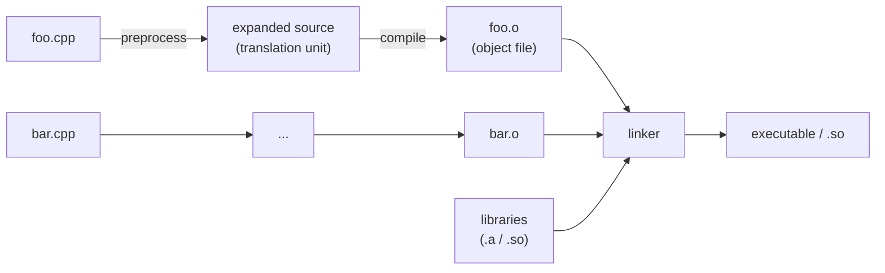
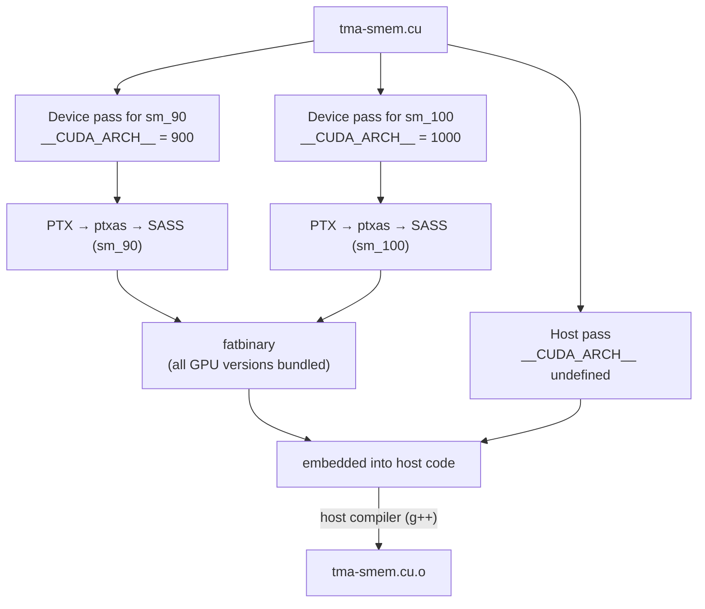
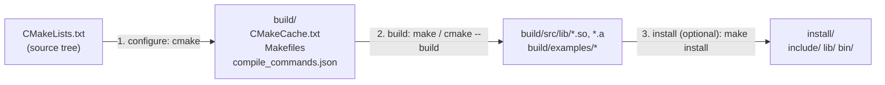
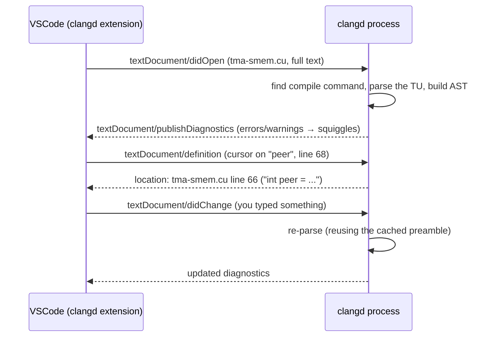
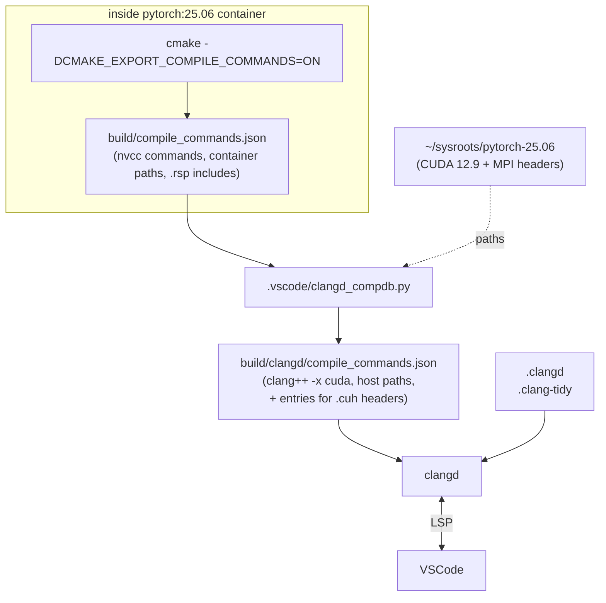

# C++/CUDA Projects and clangd: A Guide from First Principles

This guide explains, bottom-up, how a C++/CUDA project turns source files into programs, how a build system organizes that, and how the clangd language server uses all of it to give you errors, navigation and linting in VSCode. Every concept is tied back to this repo (NVSHMEM) and to the setup described in [vscode-clangd-setup.md](vscode-clangd-setup.md).

---

## Part 1: From a source file to a running program

### 1.1 The big picture

A C++ compiler never sees "the project". It compiles **one source file at a time**, then a separate program (the **linker**) glues the results together.



Four stages, each with its own job:

| Stage | Tool (GCC names) | Input → Output | What it does |
|---|---|---|---|
| Preprocess | `cpp` (inside `g++`) | `.cpp` → expanded text | Pastes `#include`d files in, expands `#define` macros, keeps or drops `#if` blocks |
| Compile | `cc1plus` | expanded text → assembly | Parses C++, type-checks, optimizes, emits machine code as assembly |
| Assemble | `as` | assembly → `.o` | Turns assembly into binary machine code (an **object file**) |
| Link | `ld` | many `.o` + libraries → executable | Resolves "function X is defined in some other file" references |

When you run `g++ -c foo.cpp -o foo.o`, the first three stages run, and `-c` means "stop before linking".

### 1.2 Translation units: the unit clangd also works with

A **translation unit (TU)** is one source file *plus everything it `#include`s, recursively*, after preprocessing. This is the single most important concept for understanding clangd: **clangd, like the compiler, only ever understands TUs.** A header file on its own is not something a compiler compiles; it only exists as text pasted into TUs.

`#include "foo.h"` is literally copy-and-paste. After preprocessing, `examples/tma-smem.cu` is hundreds of thousands of lines long, because it pulls in `nvshmem.h` → `nvshmem_host.h` → `host/nvshmem_api.h` → ... → `cuda_runtime.h` → the C++ standard library.

### 1.3 Headers vs sources: declarations vs definitions

- A **declaration** says "this thing exists, and here is its type": `int nvshmem_my_pe();`
- A **definition** provides the body or storage: `int nvshmem_my_pe() { return ...; }`

The convention:

- **Headers (`.h`, `.hpp`, `.cuh`)** hold declarations, types, macros, and small `inline`/template code. They are shared by many TUs.
- **Sources (`.cpp`, `.c`, `.cu`)** hold definitions. Each is compiled exactly once, into one `.o`.

**The One Definition Rule (ODR):** a non-inline function or global variable may be *defined* only once in the whole program. If a header contained a plain function definition and two `.cpp` files included it, the linker would see two definitions and fail with "multiple definition of ...". That is why header functions are marked `inline` or `static`, or are templates. NVSHMEM's device headers do this with macros such as `NVSHMEMI_STATIC` and `NVSHMEMI_DEVICE_ALWAYS_INLINE`.

**Include guards:** a header can end up included twice in one TU (A includes B and C, and both include D). To make the second copy a no-op, headers use either

```cpp
#ifndef _NVSHMEM_MACROS_H_      // classic include guard (src/include/host/nvshmem_macros.h)
#define _NVSHMEM_MACROS_H_
...
#endif
```

or `#pragma once`. This also explains why the clangd header setup must not pre-include a header that already includes the file being viewed. The guard would already be defined, so the whole body would be skipped and shown as greyed out.

**Self-contained headers:** a good header includes everything it needs, so `#include "x.h"` works as the first line of any file. Many NVSHMEM internal headers are **not** self-contained: they assume some other header came first. That is fine for the build, which always includes them in the right order, but it matters for clangd, which may parse a header on its own. That is exactly the leftover issue with the 7 headers listed in the setup notes.

### 1.4 The preprocessor in more detail

| Directive | Meaning | Example in NVSHMEM |
|---|---|---|
| `#include "x.h"` | Search the current file's directory first, then `-I` paths | `#include "non_abi/nvshmem_build_options.h"` |
| `#include <x.h>` | Search only `-I`/`-isystem` paths and system directories | `#include <cuda_runtime.h>` |
| `#define NAME value` | Textual substitution | `#define NVSHMEMI_STATIC static` |
| `#if / #ifdef / #else / #endif` | Conditional compilation: code in the false branch is **deleted** before compilation | `#ifdef __CUDA_ARCH__ ... #endif` |

Code in an inactive `#if` branch is never parsed or type-checked. Editors show it greyed out because, for that particular compile configuration, it doesn't exist. Which branch is active depends entirely on the **macros defined for that compile**, which come from the command-line flags. That is why clangd needs the exact flags.

### 1.5 Compiler flags you will see everywhere

| Flag | Meaning | Why it matters |
|---|---|---|
| `-I<dir>` | Add `<dir>` to the header search path | Without the right `-I`, `#include "nvshmem.h"` → "file not found" |
| `-isystem <dir>` | Like `-I`, but marks headers as "system": warnings inside them are suppressed | Used for CUDA headers, so their warnings don't flood you |
| `-D<NAME>[=val]` | Define a macro, as if `#define NAME val` were at the top of every file | `-DNVSHMEM_AARCH64`, `-DNDEBUG` (disables `assert`) |
| `-std=c++17` | Which C++ language version | Decides which language features exist |
| `-O0` / `-O3` | Optimization level | `-O3` = fast code, harder to debug |
| `-g` | Emit debug info | Needed for gdb/cuda-gdb line-level debugging |
| `-Wall -Wextra` | Enable more warnings | Catches likely bugs |
| `-Werror` | Treat warnings as errors | Build fails on any warning |
| `-fPIC` / `-fPIE` | Position-independent code / executable | Required for shared libraries (`.so`) |
| `-x <lang>` | Force the language of the next inputs (`c++`, `cuda`, `cu` for nvcc) | Needed when the extension alone is ambiguous |
| `-c` | Compile only, don't link | Every per-file build command has it |
| `-o <file>` | Output file name | `-o CMakeFiles/tma-smem.dir/tma-smem.cu.o` |
| `-L<dir>`, `-l<name>` | (link time) library search path; link `lib<name>.so`/`.a` | `-lcudart_static`, `-lrt` |
| `-Wl,<opt>` | Pass `<opt>` to the linker | `-Wl,-rpath,$ORIGIN/../../lib` |

### 1.6 Libraries: static vs shared

A **library** is a bundle of compiled code that other programs link against.

| | Static library `libX.a` | Shared library `libX.so` |
|---|---|---|
| What it is | An archive of `.o` files | A loadable binary |
| When the code is used | Copied into the executable at link time | Loaded at run time by the dynamic loader |
| NVSHMEM example | `build/src/lib/libnvshmem_device.a` (GPU-side code) | `build/src/lib/libnvshmem_host.so` (host-side runtime) |

**Shared library version names:** `libnvshmem_host.so -> libnvshmem_host.so.3 -> libnvshmem_host.so.3.9.0`. The real file carries the full version. `.so.3` (the **soname**) is what executables record, meaning "any compatible 3.x", and plain `.so` is what the linker uses for `-lnvshmem_host`.

**Finding `.so` files at run time:** the dynamic loader searches the paths embedded in the binary (**rpath**, e.g. `$ORIGIN/../../lib`, where `$ORIGIN` means "the directory this binary is in"), then `LD_LIBRARY_PATH`, then system directories.

**Plugins:** NVSHMEM also loads bootstrap and transport plugins at run time with `dlopen` (e.g. `nvshmem_bootstrap_mpi.so`, `nvshmem_transport_ibrc.so`). That is why those `.so` files exist separately rather than being linked in.

**API vs ABI:** the **API** is the source-level contract (function names and signatures in headers). The **ABI** (Application *Binary* Interface) is the binary-level contract (struct layouts, calling conventions, symbol names). NVSHMEM separates headers whose binary layout is a stable promise from `non_abi/` headers that may change between releases. Code built against a different version must not depend on the `non_abi/` layouts.

---

## Part 2: What CUDA adds

### 2.1 One source file, two kinds of machine code

A `.cu` file contains code for **two different processors**:

- **Host** code runs on the CPU (here: aarch64 Grace).
- **Device** code runs on the GPU (here: B200, compute capability 10.0 = `sm_100`).

Every function has an **execution space**:

| Qualifier | Runs on | Callable from |
|---|---|---|
| (none) or `__host__` | CPU | CPU |
| `__device__` | GPU | GPU |
| `__host__ __device__` | compiled for both | both |
| `__global__` | GPU (a **kernel**) | launched from CPU with `kernel<<<grid, block, smem, stream>>>(...)` |

### 2.2 How nvcc compiles a `.cu` file: multiple passes

`nvcc` is a *driver*: it splits the work and calls other compilers.



Key consequences:

- **The same file is preprocessed several times with different macros.** In the host pass, `__CUDA_ARCH__` is undefined. In each device pass it is defined to the target architecture (`900` for sm_90, `1000` for sm_100). So this code in `examples/tma-smem.cu`

  ```cpp
  #if __CUDA_ARCH__ >= 900
      asm volatile("fence.proxy.async.shared::cta;\n" ::: "memory");
  #endif
  ```

  exists only in device passes for Hopper or newer. `#ifdef __CUDA_ARCH__` is the standard idiom for "this is GPU-only code", as in `src/include/non_abi/device/common/nvshmemi_common_device.cuh`.
- **PTX vs SASS:** **PTX** is NVIDIA's virtual assembly (portable across GPU generations). **SASS** is the real machine code for one specific GPU. The flag `--generate-code=arch=compute_90,code=[sm_90]` means "generate PTX for virtual arch `compute_90`, then compile it to SASS for `sm_90`". `code=[compute_120,sm_120]` additionally embeds the PTX itself, so a future GPU's driver can JIT-compile it.
- **The fatbinary** bundles SASS/PTX for all requested architectures. At run time, the CUDA driver picks the best one for the GPU present.

### 2.3 Relocatable device code (`-rdc=true`) and device linking

By default, each `.cu` file's device code must be self-contained: a kernel in `a.cu` cannot call a `__device__` function *defined* in `b.cu`. **Relocatable device code** (`-rdc=true`; clang's equivalent is `-fgpu-rdc`) lifts this restriction. It keeps GPU code in a linkable form, and an extra **device link** step (`nvlink`) resolves cross-file GPU calls.

NVSHMEM depends on this: your kernel calls `nvshmemx_putmem_nbi_block(...)` on the GPU, and part of that GPU code lives in `libnvshmem_device.a`. That's why the example and test commands have `-rdc=true`, and why the device library is static (`.a`). NVSHMEM can also ship device code as **LTO-IR** (`.ltoir` files, a form suited to link-time optimization), which is why `build/src/lib/` has `libnvshmem_device_sm_90.ltoir`.

### 2.4 nvcc vs clang for CUDA

Clang can compile CUDA too (`clang++ -x cuda --cuda-gpu-arch=sm_100 --cuda-path=...`). It follows the same host-pass/device-pass model, but clang is **stricter** in some places. In NVSHMEM's headers, nvcc accepts two patterns that clang rejects:

- redeclaring a `__host__ __device__` function as `__device__` (clang: `cuda_ovl_target`),
- redeclaring a non-static function as `static` (clang: `static_non_static`).

The build uses nvcc, so these are not real problems, which is why `.clangd` suppresses them. Knowing that "clang's opinion" and "nvcc's opinion" can differ is important when reading editor diagnostics on CUDA code.

---

## Part 3: Build systems (Make and CMake)

### 3.1 Why a build system

NVSHMEM has hundreds of source files. Each needs its own compile command (flags differ per target), and files must be rebuilt only when they or their headers change. Libraries must be linked in the right order, generated headers produced first, and so on. Writing that by hand is impossible, so a build system does it.

- **Make** runs rules from a `Makefile`: "to build `foo.o`, run this command when `foo.cpp` or its headers are newer than `foo.o`".
- **CMake** is a *meta* build system. You describe *what* to build in `CMakeLists.txt`, and CMake generates Makefiles (or Ninja files) that describe *how*.

### 3.2 CMake's two phases



1. **Configure** (`cmake -S <source> -B <build> -D...`): runs the `CMakeLists.txt` scripts and probes the compilers (this is why it must run in the container, where `nvcc` exists). It records options in `build/CMakeCache.txt` (e.g. `NVSHMEM_MPI_SUPPORT:BOOL=ON`, `CMAKE_CUDA_COMPILER=/usr/local/cuda/bin/nvcc`) and writes the Makefiles. With `-DCMAKE_EXPORT_COMPILE_COMMANDS=ON`, it also writes `compile_commands.json`.
2. **Build** (`make -j` in `build/`): runs the actual compile and link commands.
3. **Install** (`make install`): copies the public result (headers, libraries, binaries) to `CMAKE_INSTALL_PREFIX` (here `~/nvshmem/install`), laid out the way a user of the library expects.

**Out-of-source builds:** all generated files go into `build/`, never into the source tree. You can delete `build/` and reconfigure at any time, or have several build dirs (debug/release) from one source tree.

### 3.3 Targets and how flags are assigned

Modern CMake is organized around **targets**: things to build, each with properties.

```cmake
add_library(nvshmem_host SHARED ...sources...)                # a shared library target
add_executable(tma-smem tma-smem.cu)                          # an executable target
target_include_directories(nvshmem_host PRIVATE some/dir)     # adds -Isome/dir
target_compile_definitions(nvshmem_host PRIVATE FOO=1)        # adds -DFOO=1
target_link_libraries(tma-smem nvshmem_host nvshmem_device)   # link + inherit usage requirements
```

`PRIVATE` / `PUBLIC` / `INTERFACE` control propagation. `PRIVATE` applies to this target only. `INTERFACE` applies to whoever links this target. `PUBLIC` applies to both. When `examples/CMakeLists.txt` does `target_link_libraries(${NAME_} nvshmem_host nvshmem_device)`, the example automatically gets NVSHMEM's public include directories and definitions. **That is how each source file ends up with its own, different compile command**, which is exactly what `compile_commands.json` records.

### 3.4 `compile_commands.json`: the bridge between the build and the editor

This file (the **compilation database**) is a JSON list with one entry per source file:

```json
{
  "directory": "/mnt/home/wli10/nvshmem/build/examples",
  "command": "/usr/local/cuda/bin/nvcc -DNVSHMEMTEST_MPI_SUPPORT ... -I... -x cu -rdc=true -c /mnt/home/wli10/nvshmem/examples/tma-smem.cu -o CMakeFiles/tma-smem.dir/tma-smem.cu.o",
  "file": "/mnt/home/wli10/nvshmem/examples/tma-smem.cu"
}
```

- `directory`: the working directory the command runs in (relative paths in the command are relative to it).
- `command` (or `arguments`, already split into a list): the exact compiler invocation.
- `file`: the source file.

It contains **only source files that the build compiles**. Headers are not listed, because they are never compiled on their own. Files excluded by build options are not listed either: `examples/shmem-based-init.cu` is missing because SHMEM support is off.

---

## Part 4: This repository's structure

| Path | What it is |
|---|---|
| `CMakeLists.txt` | Top-level build script; `add_subdirectory(src)` etc. |
| `src/include/` | **Public headers.** `nvshmem.h`, `nvshmemx.h` (umbrella headers you include), `host/` (CPU API), `device/` (GPU API), `device_host/` (shared by both), `non_abi/` (internal, layout may change), `internal/` |
| `src/host/` | Host-side runtime sources → `libnvshmem_host.so` (init, memory heap, teams, collectives, proxy thread, topology) |
| `src/device/` | GPU-side library sources → `libnvshmem_device.a` |
| `src/modules/` | Plugins built as separate `.so`: `bootstrap/` (how processes find each other: MPI, PMI, UID) and `transport/` (how data moves between nodes: IBRC, IBGDA, UCX, libfabric) |
| `examples/` | Small programs showing API usage (`tma-smem.cu`, `dev-guide-ring.cu`, ...) |
| `perftest/` | Performance benchmarks (`device/pt-to-pt/shmem_put_bw.cu`, ...) |
| `test/` | Functional/unit tests |
| `nvshmem4py/` | Python bindings |
| `externals/`, `cmake_config/`, `scripts/` | Third-party code, CMake helpers, tooling |
| `build/` | **Generated** by CMake (in the container). `build/src/lib/` holds the built libraries; `build/src/include/` is a copy of the public headers staged for examples/perftest/tests, which compile against it as if NVSHMEM were installed |
| `install/` | Result of `make install` |

**Two include roots:** library sources (e.g. `src/host/init/init.cu`) compile with `-I src/include`, while examples compile with `-I build/src/include`. Ctrl+click from an example therefore opens the copy under `build/src/include/...`, not `src/include/...`. If you edit the header in `src/`, the copy is refreshed on the next build.

**The toolchain lives in a container:** CUDA 12.9 (`/usr/local/cuda`), HPC-X Open MPI (`/usr/local/mpi` → `/opt/hpcx/ompi`), and nvcc all exist only inside `nvcr.io/nvidia/pytorch:25.06-py3`. The machine VSCode runs on has none of them. That is the root reason the clangd setup needs a translation script and a host-side copy of the headers.

---

## Part 5: How clangd works

### 5.1 What clangd is

**clangd** is a **language server**: a background program that understands C/C++/CUDA code and answers questions from an editor. It is built from the **same front end as the clang compiler** (the part that preprocesses, parses and type-checks). So when clangd reports an error, it is a real compiler error, not a guess based on pattern matching.

VSCode and clangd talk using the **Language Server Protocol (LSP)**: JSON messages over the process's stdin/stdout. The clangd VSCode extension is only a thin client: it starts `~/envs/buildtools/bin/clangd` and relays messages.



### 5.2 What clangd needs as input

To understand a file exactly as the compiler would, clangd needs:

1. **The file's text.** VSCode sends the live buffer, including unsaved edits.
2. **The compile command for that file:** all `-I`, `-isystem`, `-D`, `-std`, `-x`, target flags. Without it, clangd has to guess, and guesses produce "file not found" and wrong `#if` branches.
3. **The headers themselves on disk**, at the paths the flags point to.
4. **Builtin compiler headers:** clang ships its own `stddef.h`, intrinsics, and the CUDA wrapper headers (`__clang_cuda_runtime_wrapper.h`). clangd finds them in its **resource directory** (`.../site-packages/clangd/data/lib/clang/22`), which must match clangd's own version.
5. **The system C++ standard library.** The clang driver locates the host GCC installation and adds its `libstdc++` headers (`/usr/lib/gcc/aarch64-linux-gnu/13/...`). You can see this in the `-internal-isystem` lines of `clangd --check` output. If the build used a cross-compiler, you would pass `--query-driver` so clangd can ask that compiler for its system paths.
6. **For CUDA only:** a CUDA installation (`--cuda-path`) with `include/`, `bin/` (it only has to exist) and `nvvm/libdevice/libdevice.10.bc`, plus the GPU architecture (`--cuda-gpu-arch=sm_100`), which decides the value of `__CUDA_ARCH__`.

Items 2, 3 and 6 are what the setup provides: the translated `build/clangd/compile_commands.json`, and `~/sysroots/pytorch-25.06/` as the host copy of the container's CUDA and MPI headers.

### 5.3 How clangd finds the compile command

For each opened file, clangd tries, in order:

1. **An explicit database location**, if configured. The repo's `.clangd` says `CompilationDatabase: build/clangd`.
2. Otherwise, it **searches upward** from the file's directory for `compile_commands.json` or `compile_flags.txt`, also checking a `build/` subdirectory at each level.
3. **Exact match:** if the file is listed in the database, clangd uses that entry.
4. **Interpolation (inference):** if the file is *not* listed (headers, disabled sources), clangd picks the listed file that looks most similar by path and name, and adapts its command (e.g. switches `-x` to match the extension). Its log says `Compile command inferred from ...`.
5. **Fallback:** with no database at all, it uses a generic command (roughly `clang file.cpp`) and no include paths, so almost everything turns red.

Step 4 caused the greyed-out `#ifdef __CUDA_ARCH__` in `nvshmemi_common_device.cuh`. The "most similar" file was `src/modules/bootstrap/common/bootstrap_util.cpp`, a host-only C++ file. The header was therefore parsed as plain C++, so `__CUDA_ARCH__` was undefined. The fix was to add explicit header entries (step 3) copied from the nearest `.cu` file.

**Adjusting commands without touching the database:** `.clangd` can modify flags (`CompileFlags: Add/Remove/Compiler`). The setup uses `Add: [-ferror-limit=0]`. Most of the translation is still done in the database itself (by the script), because the command-line `clang-tidy` reads the database but ignores `.clangd`.

### 5.4 What clangd does with the command: parsing a TU

1. **Driver step:** the command goes through clang's driver logic, the same code that runs when you type `clang++ ...`. It turns high-level flags into internal compiler (`-cc1`) flags. `clangd --check` prints this as `internal (cc1) args are: ...`.
   - **CUDA:** the driver would normally create one host job plus one device job per architecture. clangd builds **one** AST, and in this setup it is the **device** side. The cc1 line shows `-triple nvptx64-nvidia-cuda -fcuda-is-device -target-cpu sm_100`, so `__CUDA_ARCH__ == 1000`. This is why `#ifdef __CUDA_ARCH__` code is live, and why purely host-only branches (`#ifndef __CUDA_ARCH__`) appear greyed out. Host functions in the file are still parsed and navigable.
2. **Preprocess and parse** the whole TU into an **AST (Abstract Syntax Tree)**: a data structure where every declaration, expression and type is a node, fully resolved. For example, the node for `peer` in `nvshmemx_putmem_nbi_block(..., peer)` knows it refers to the local `int peer` declared on the line above.
3. **Semantic analysis:** type checking, overload resolution, template instantiation, CUDA execution-space checks. Errors found here become **diagnostics**.
4. **Preamble caching:** the `#include`s at the top of a file (the **preamble**) are usually most of the TU but rarely change while you type. clangd compiles the preamble once into a precompiled-header-like snapshot, kept in memory because of `--pch-storage=memory`. After each keystroke it re-parses only your file on top of it, which is why edits stay fast even though the TU is huge. Editing an `#include` line rebuilds the preamble, which takes a few seconds.

### 5.5 Which features come from what

| Feature | How clangd produces it |
|---|---|
| Red/yellow squiggles | Clang diagnostics from parsing the TU (each has an ID like `undeclared_var_use`, which `.clangd` can `Suppress`) |
| Lint warnings | **clang-tidy** checks run on the same AST (rules in `.clang-tidy`); shown with the check name, e.g. `[cppcoreguidelines-init-variables]` |
| Greyed-out code | `#if` branches that are false for this compile command |
| Go to definition / declaration | Resolve the AST node under the cursor → its declaration. If the definition is in another TU (e.g. host code in `src/host/...`), use the **index** |
| Find all references, rename, call hierarchy | The **index** |
| Hover | Type, documentation comment, and size/offset info from the AST |
| Completion | Ask the parser "what names are valid here?" at the cursor position |
| Inlay hints | Parameter names and deduced `auto` types from the AST (enabled in `.clangd`) |
| Workspace symbol search (Ctrl+T) | The **index** |

### 5.6 The index: knowledge beyond the open file

The AST only covers the TU you have open. To answer "where else is this function used?", clangd keeps an **index**: a compact table of every symbol (name, kind, declaration/definition locations, references).

- The **dynamic index** covers files you currently have open.
- The **background index** (`--background-index`) walks through *every* entry in the compilation database in the background, parses each, and saves the result to `.cache/clangd/index/` in the repo. The first run takes minutes; later runs only re-index changed files. Until it finishes, "find references" can be incomplete.

### 5.7 clang-tidy inside clangd

**clang-tidy** is a collection of checks that look for bug patterns and style issues in the AST: uninitialized variables, suspicious `memset` sizes, redundant comparisons, and so on. clangd runs it automatically (`--clang-tidy`) on each file you open, using the nearest `.clang-tidy` file. A few very expensive checks, notably the `clang-analyzer-*` static-analyzer family, are skipped in the editor. The command-line `clang-tidy` (the "clang-tidy: current file" task) runs them.

### 5.8 Configuration files, and where each setting lives

| File | Read by | Controls |
|---|---|---|
| `.vscode/settings.json` | VSCode | Which clangd binary, its command-line arguments, disabling cpptools IntelliSense |
| `.clangd` (YAML) | clangd | Database location, flag edits, suppressed diagnostics, include-cleaner, inlay hints |
| `.clang-tidy` (YAML) | clangd and CLI clang-tidy | Which lint checks are on |
| `build/clangd/compile_commands.json` | clangd and CLI clang-tidy | Per-file compile commands |
| `~/.config/clangd/config.yaml` | clangd | User-wide defaults (not used here) |

---

## Part 6: How this repo's setup ties it together



What the translation script changes, and why, in terms of the concepts above:

| Problem in CMake's database | Why clangd can't use it | What the script does |
|---|---|---|
| Include paths hidden in `--options-file includes_CUDA.rsp` | clang doesn't understand nvcc's options-file syntax → no `-I` → "file not found" | Reads the `.rsp` file and inlines its flags |
| nvcc-only flags (`--generate-code`, `-rdc=true`, `-Xcompiler=...`, `-x cu`, `-t4`) | Unknown to clang | Drops them or maps them to clang equivalents (`-fgpu-rdc`, `-x cuda`, unwrap `-Xcompiler`) |
| `/usr/local/cuda`, `/opt/hpcx/ompi` | Exist only inside the container | Rewritten to `~/sysroots/pytorch-25.06/...` |
| No CUDA settings for clang | clang needs to know where CUDA is and which GPU | Adds `--cuda-path`, `--cuda-gpu-arch=sm_100` |
| Headers not listed | clangd infers from a possibly host-only `.cpp` | Adds explicit CUDA entries for `.cuh` (and `device/` headers), pre-including prerequisite headers |

### A worked example: Ctrl+click on `peer` in `examples/tma-smem.cu`

1. You open `examples/tma-smem.cu`. VSCode sends its text to clangd.
2. clangd reads `.clangd`, loads `build/clangd/compile_commands.json`, and finds the exact entry for `tma-smem.cu` (directory `build/examples`, `clang++ -x cuda --cuda-gpu-arch=sm_100 -I.../build/src/include ...`).
3. The driver turns that into a device-side cc1 job for `sm_100`, so `__CUDA_ARCH__ = 1000`.
4. clangd builds (or reuses) the preamble: `stdio.h`, `nvshmem.h`, `nvshmemx.h` and everything they include, resolved via the `-I` paths from `build/src/include` and the CUDA headers from the sysroot.
5. It parses the rest of the file. `#if __CUDA_ARCH__ >= 900` is true, so the `fence.proxy.async` line is live, not greyed out.
6. It publishes diagnostics and runs the clang-tidy checks.
7. You Ctrl+click `peer` in `nvshmemx_putmem_nbi_block(recv_data, payload, ..., peer)`. The AST node for that argument is a reference to the local variable declared in `int peer = (mype + 1) % npes;`, so clangd returns that line immediately, with no index needed.
8. Ctrl+click on `nvshmemx_putmem_nbi_block` instead leads to its declaration in `build/src/include/...`. "Find all references" on it consults the background index to list every call site across examples, perftests and the library.

---

## Part 7: Troubleshooting checklist

| Symptom | Likely cause | What to do |
|---|---|---|
| `'xxx.h' file not found` | Missing or wrong `-I` for this file, or inference picked a bad neighbour | Run `clangd --check=<file> --check-locations=false` and read the "Compile command" line |
| A whole `#ifdef __CUDA_ARCH__` block greyed out | File parsed as host C++ (not CUDA device) | Check the cc1 line contains `-fcuda-is-device`; for headers, rerun the script so they get explicit entries |
| Errors in a header you didn't touch, only when it's opened alone | Header isn't self-contained | Open a `.cu` file that includes it instead; the code is checked correctly there |
| Errors everywhere after rebuilding | Database is stale (sources/targets changed) | Rerun `python3 .vscode/clangd_compdb.py`, then "clangd: Restart language server" |
| Error that nvcc doesn't report | nvcc vs clang strictness difference | Check whether the build actually fails; if not, consider adding the diagnostic ID to `Suppress` in `.clangd` |
| Find references incomplete | Background index still running | Watch the "indexing" progress in the status bar |
| Weird stale results | Corrupted index cache | Delete `.cache/clangd/` and restart clangd |

**Where to look:**

- VSCode "Output" panel → dropdown "clangd": the live log, including the compile command for each file.
- `~/envs/buildtools/bin/clangd --check=<file> --check-locations=false`: a one-shot parse of a file from the terminal. It prints the compile command, the internal cc1 arguments, and all errors.

---

## Glossary

| Term | Meaning |
|---|---|
| **TU (translation unit)** | One source file plus all its includes after preprocessing; the unit a compiler (and clangd) processes |
| **AST** | Abstract Syntax Tree: the compiler's fully resolved in-memory model of the code |
| **Object file (`.o`)** | Compiled machine code of one TU, not yet linked |
| **Linker** | Combines object files and libraries into an executable or shared library |
| **ODR** | One Definition Rule: each non-inline function/variable is defined once per program |
| **Include guard** | `#ifndef X / #define X / #endif` or `#pragma once`; prevents double inclusion |
| **Static / shared library** | `.a` copied into the executable at link time / `.so` loaded at run time |
| **ABI** | Binary-level compatibility contract (layouts, symbols, calling conventions) |
| **rpath** | Library search path embedded in a binary |
| **Host / device** | CPU side / GPU side of a CUDA program |
| **Kernel** | A `__global__` function launched on the GPU from the host |
| **`__CUDA_ARCH__`** | Macro defined only in device passes, equal to the target compute capability × 100 (e.g. 1000) |
| **PTX / SASS** | Portable virtual GPU assembly / real GPU machine code for one architecture |
| **Fatbinary** | Bundle of SASS/PTX for several GPU architectures embedded in a binary |
| **RDC** | Relocatable device code: lets GPU code call GPU functions in other files; needs a device-link step |
| **CMake configure / build** | Generate build files and cache / run the compile and link commands |
| **Target** | A CMake unit (library or executable) with its own sources, flags and dependencies |
| **Compilation database** | `compile_commands.json`: per-file compile commands |
| **LSP** | Language Server Protocol: how editors talk to language servers like clangd |
| **Preamble** | The block of `#include`s at the top of a file, cached by clangd to speed up re-parsing |
| **Index** | clangd's cross-file symbol table used for references, rename and workspace search |
| **clang-tidy** | Linter that runs rule-based checks on the clang AST |
| **Resource directory** | Folder with clang's own builtin headers; must match the clang/clangd version |
| **Sysroot** (as used here) | A directory holding a copy of another environment's headers (the container's CUDA/MPI) |
