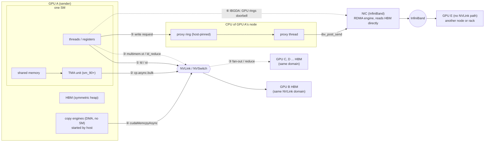

# GPU Data Movement Paths

Every way NVSHMEM can move bytes from one GPU's memory to another's: which hardware does the copying, who starts it, which source function picks it, and when TMA is the right choice.

NVSHMEM 3.9.0.dev0 · branch `devel` @ 7bb2e99 · paths relative to repo root · companion to `tma-smem-walkthrough.html` · HTML version: `data-movement-paths.html`

---

## A. Short answer

> **TMA is not the default for GPU-to-GPU copies.** A device-side put or get to a peer GPU reachable over NVLink is done by **ordinary thread loads and stores** unless all of these hold: `NVSHMEM_TMA_POLICY=ENABLE` (or `FORCE`), the GPU is sm_90 or newer, the calling block has lent shared memory with `nvshmemx_give_smem`, and both addresses and the byte count are multiples of 16. If any check fails, the same call silently falls back to thread load/store (`nvshmemii_put_nbi`, `src/include/non_abi/device/common/nvshmemi_common_device.cuh:1444-1472`).

TMA is worth enabling when **the data is already in shared memory** (for example the output tile of a fused GEMM), or when **only a few threads issue the transfer** and you want the other threads free for computation. It does nothing for peers reached over the network, and it costs shared memory (64 KiB per block recommended). Section E has the full reasoning.

Besides thread load/store and TMA, NVSHMEM has five other ways to move data: NVLink multicast stores through the NVSwitch, the GPU's copy engines (started from the host with `cudaMemcpyAsync`), a CPU proxy thread that drives the InfiniBand card, IBGDA (the GPU drives the InfiniBand card itself), and "logical endpoint" handles on the newest CUDA.

---

## B. Map of all seven paths



① to ④ and ⑦ need the peer's memory mapped into this GPU (the "P2P" or "NVLink-reachable" case). ⑤ and ⑥ are for peers only reachable over the network. ③ and ④ are not picked by `nvshmem_putmem` inside a kernel: ③ is used by collectives, ④ by host-called APIs. ⑦ (logical-endpoint handles) also goes through the TMA unit and is compiled out of your build, so it is not drawn separately.

| # | Path | Who starts it | Who moves the bytes | Your build |
|---|---|---|---|---|
| 1 | Thread load/store | GPU kernel, every thread | SM threads, through registers | on (default) |
| 2 | TMA bulk copy | GPU kernel, one elected thread | TMA unit inside the SM | off until `NVSHMEM_TMA_POLICY=ENABLE` |
| 3 | NVLS multicast | GPU kernel (collectives) | SM threads + NVSwitch | on if the NVSwitch supports it |
| 4 | Copy engine | CPU (host API) | GPU copy engines (DMA) | on |
| 5 | CPU proxy + IB | GPU kernel writes a request | CPU thread posts, NIC copies | on (IBRC transport) |
| 6 | IBGDA | GPU kernel | GPU posts, NIC copies | not compiled |
| 7 | LE / CFT handles | GPU kernel | TMA unit, addressed by endpoint id | not compiled |

"Your build" comes from `build/CMakeCache.txt`: `NVSHMEM_IBRC_SUPPORT=ON`, `NVSHMEM_IBGDA_SUPPORT=OFF`, `NVSHMEM_UCX_SUPPORT=OFF`, `NVSHMEM_LIBFABRIC_SUPPORT=OFF`, `NVSHMEM_CFT_HANDLES_SUPPORT=OFF`, `CMAKE_BUILD_TYPE=release`.

---

## C. Terms used

| Term | Meaning |
|---|---|
| PE | Processing element: one process of the job, owning one GPU. |
| P2P / NVLink-reachable | The peer GPU's memory is mapped into this GPU's address space, so a normal pointer to it works. NVSHMEM records this as a non-null entry in `peer_heap_base_p2p[pe]`. On Beta that is the other 3 GPUs of the node, and, when multi-node NVLink works, all 72 GPUs of the rack. |
| SM | Streaming multiprocessor: one of the ~150 compute units of a GPU. A thread block runs on one SM. |
| ld / st | Load and store instructions executed by threads. A store to a peer address travels over NVLink. |
| TMA | Tensor Memory Accelerator: a copy unit inside each SM (sm_90 Hopper, sm_100 Blackwell) that copies between shared memory and global memory after one thread starts it. |
| copy engine (CE) | A DMA unit on the GPU, separate from the SMs, used by `cudaMemcpy*`. It uses no SM time but can only be started from the host through a CUDA stream. |
| NVLS / multimem | NVLink SHARP: the NVSwitch can copy one store to many GPUs (`multimem.st`) or add up values from many GPUs on a load (`multimem.ld_reduce`). Addresses must come from a multicast object. |
| NIC / HCA | Network interface card (InfiniBand "host channel adapter"). It can read and write GPU memory directly (GPUDirect RDMA). |
| RDMA, WQE, doorbell | Remote direct memory access: the NIC copies memory to a remote node without that node's CPU. A work-queue entry (WQE) describes one copy; writing the "doorbell" register tells the NIC to start. |
| proxy thread | A CPU thread NVSHMEM starts at init. It reads requests that GPU kernels write into a ring buffer and posts them to the NIC. |
| IBRC | InfiniBand Reliable Connection transport: NVSHMEM's host-driven IB transport (`src/modules/transport/ibrc`), used by the proxy. |
| IBGDA | InfiniBand GPUDirect Async: GPU threads build WQEs and ring the doorbell themselves, with no CPU in the loop. |
| scope (thread / warp / block) | How many threads call the API together: `nvshmem_putmem` is one thread, `nvshmemx_putmem_warp` 32 threads, `nvshmemx_putmem_block` the whole block. |
| nbi | Non-blocking-initiation: the call may return before the data arrives; `nvshmem_quiet` waits for completion. |
| mbarrier | A hardware barrier object in shared memory. TMA loads signal it when their bytes have landed. |

---

## D. Who picks the path

You do not choose the hardware by calling a different function. The same `putmem` call picks a path at run time from the peer's reachability, the build, environment variables and the operands. There are two entry points, one per side.

### Device side: `nvshmem_putmem` / `nvshmemx_putmem_{warp,block}[_nbi]` called in a kernel

- **`nvshmemii_put_nbi<T, SCOPE>()`** — `common/nvshmemi_common_device.cuh:1444-1472`. Blocking variant: `nvshmemi_put`, :1485-1515; gets: `nvshmemi_get`, :1380-1413. All have the same shape.
  - **`peer_heap_base_p2p[pe] != NULL` ?** (P2P) — peer mapped (NVLink or PCIe peer access). `nvshmemi_peer_reachable`, `common/nvshmemi_path_predicates.cuh:54`.
    - **registration valid and `nvshmemi_memcpy_tma*() == 0`** → **path 2**. TMA, if policy on, sm_90+, block called `give_smem`, 16-byte aligned. Returns −1 otherwise.
    - **else `nvshmemi_memcpy_threadgroup()`** → **path 1**, thread load/store.
  - **else if LE handle usable** → path 7 (off). Needs sm_100 + CUDA 13.3 + `NVSHMEM_CFT_HANDLES_SUPPORT`. Compiled out here.
  - **else `nvshmemi_rma_nbi()` → `nvshmemi_transfer_rma_nbi()`** (network) — `pt-to-pt/transfer_device.cuh:266`. Switch on `selected_device_transport`: IBGDA (path 6) or PROXY (path 5, default).

### Host side: `nvshmem_putmem` / `nvshmemx_putmem_on_stream` called from CPU code

- **`nvshmemi_prepare_and_post_rma()`** — `src/host/comm/putget.cpp:235-318`
  - **`get_local_pe_bases()[pe] != NULL` → `nvshmemi_prepare_and_post_mapped_rma()`** → **path 4** (:190-233). Peer mapped: `cudaMemcpyAsync` or `cudaMemcpy2DAsync`, i.e. the copy engine.
  - **off-stream, remote → `tcurr->host_ops.rma()`** (network, :258-298). The *calling* CPU thread posts to the NIC through the IBRC transport. "IBGDA will not set the RMA transport because it doesn't work on host APIs" (comment at :262).
  - **on-stream, remote → `nvshmemi_proxy_rma_launcher()`** → **path 5** (`src/host/comm/rma.cu:10-21`). Launches a 1-thread kernel on your stream; that kernel takes the device path above, so it ends up in the proxy ring.

Collectives (`nvshmem_*_reduce`, `broadcast`, `fcollect`, `alltoall`) run their own device kernels that use path 1, 3 or the network paths through the same helpers.

---

## Path 1. Thread load/store over NVLink

*`nvshmemi_common_device.cuh:327-438`*

The default. NVSHMEM converts your symmetric address to the peer's mapped address (`peer_base + (dest − heap_base)`) and then every thread of the calling group copies a slice with plain C++ assignments. The loop tries the widest access the alignment allows: 16-byte (`int4`), then 8, 4, 2 and 1 bytes for the tail.

```cpp
if ((uintptr_t)dst % 16 == 0 && (uintptr_t)src % 16 == 0) {
    const size_t nelems = len / 16;
    int4 *dst_p = (int4 *)dst;  const int4 *src_p = (const int4 *)src;
    for (size_t i = myIdx; i < nelems; i += groupSize)
        dst_p[i] = src_p[i];            // LDG.128 from local, STG.128 to peer
    len -= nelems * 16;
    ...
}
/* then 8-, 4-, 2-, 1-byte loops for whatever is left */
```

*`nvshmemi_memcpy_threadgroup`, condensed. `myIdx` / `groupSize` are the thread's rank and size within the thread / warp / block scope.*

**Call chain**

- `nvshmemx_putmem_block(dest, src, n, pe)` — `src/include/device/nvshmemx_defines.h`
  - `nvshmemi_put<char, BLOCK>()` — common:1485
    - `nvshmemi_memcpy_threadgroup<BLOCK>(dest_actual, src, n)` — common:327. Each of N threads moves every N-th 16-byte chunk.
- `nvshmem_quiet()` — common:1185-1212. On an NVLink-only job this is just `__threadfence_system()`: stores are already on their way, so it only has to order them.

**Properties.** Bandwidth grows with the number of threads issuing (each thread only keeps a few stores in flight), so a whole block or many blocks can fill NVLink, but one thread cannot. The source can be anywhere a thread can read: registers, shared memory, global memory. Works on every GPU generation and any alignment. Scalar puts (`nvshmem_int_p`) and `SIGNAL_SET` are single stores on this path (`nvshmemi_p` common:1421, `nvshmemi_signal_op` common:1519); signal adds are `atomicAdd_system`.

**Doing it yourself.** `nvshmem_ptr(dest, pe)` (`src/include/device/nvshmem_defines.h:1404`) returns the peer's mapped address, or NULL if not reachable. With that pointer you can write the peer's memory directly from your own code, which is how many fused kernels avoid the API's group synchronisations.

---

## Path 2. TMA bulk copy over NVLink

*`pt-to-pt/tma_device.cuh`, `nvshmemi_common_device.cuh:444-1182`*

The TMA unit copies a contiguous run of bytes between the SM's shared memory and a global address. It cannot copy global→global directly, so NVSHMEM has four shapes, chosen by where the local operand lives:

```text
A · PUT, source in shared memory (direct, one hop)
    local smem ──cp.async.bulk.global.shared::cta──────────────▶ peer HBM

B · PUT, source in global memory (staged, two hops)
    local HBM ──load + mbarrier──▶ smem tile (lent by give_smem) ──store──▶ peer HBM
    block scope: two tiles; thread 0 loads tile i+1 while thread 32 stores tile i

C · GET, destination in shared memory (direct)
    peer HBM ──cp.async.bulk.shared::cta.global + mbarrier─────▶ local smem

D · GET, destination in global memory
    same helper as B with source and destination swapped:
    peer HBM ──▶ smem tile ──▶ local HBM
```

Every shape needs a registered block, 16-byte-aligned addresses and a byte count that is a multiple of 16; otherwise the helper returns −1 and the call uses path 1.

**Call chain, device put and get**

- `nvshmemi_tma_get_smem_registration()` — common:494-515. Looks up this block's entry in the table filled by `give_smem`. Invalid if policy is DISABLE (default), arch < sm_90, or the block never registered.
- `nvshmemi_memcpy_tma[_nbi]<SCOPE>()` — common:1164-1182. Put dispatcher: `__isShared(source)` picks A, otherwise B.
  - **A:** `nvshmemi_memcpy_tma_shared_global<SCOPE, BLOCKING>()` — `tma_device.cuh:320-380`. Thread scope: the caller issues. Warp / block: one `elect.sync` leader issues the whole transfer as one instruction. The caller must first run `fence.proxy.async.shared::cta` (contract at `tma_device.cuh:304-308`).
  - **B:** `nvshmemi_memcpy_tma_global_global_single<SCOPE>()` — common:849-933. Thread / warp scope. One tile (registered size − 1,136 bytes, ~63 KiB). Loop per chunk: load into tile, wait on mbarrier slot 0, store to peer, then `wait_group.read 0` before reusing the tile. So load and store do not overlap.
  - **B:** `nvshmemi_memcpy_tma_global_global_block<BLOCKING>()` — common:963-1100. Block scope, needs ≥ 64 threads. Double-buffered: two half-size tiles, `ready_bar[2]` / `done_bar[2]` mbarriers; thread 0 loads, thread 32 (`warpSize`) stores, so loads of tile i+1 overlap stores of tile i.
- `nvshmemi_get<T, SCOPE>()` — common:1380-1413. `__isShared(dest)` → `nvshmemi_memcpy_tma_global_shared` (C, common:777-830, mbarrier slot 4); otherwise `nvshmemi_memcpy_tma_global_global` with peer as source (D).

### Completion: quiet vs flush

- **`nvshmem_quiet`**: `nvshmemi_tma_drain_if_registered()`: `commit_group` + `wait_group 0`, i.e. wait until the TMA has finished writing, then `__threadfence_system()` (common:576-587, 1185-1212). Only waits for groups issued by the *calling* thread.
- **flush (source reuse)**: `wait_group.read 0` + proxy fence: wait only until the TMA has *read* the source, so you may overwrite it; the data may not have arrived yet (common:1224-1268). For path 1 flush is a no-op, because a store has already read its register.

The per-thread tracking is the trap noted in the tma-smem walkthrough: the block put's staged copies are issued by thread 32, and a later `nvshmem_quiet()` from thread 0 does not wait for them. Calling `nvshmem_quiet()` from every thread of the block (each drains its own groups) or using the blocking put avoids it (reading of the code, not verified by a run).

---

## Path 3. NVLink multicast (NVLS)

*`nvshmemi_common_device.cuh:222-325`, `coll/broadcast.cuh`, `coll/reduce.cuh`*

Still thread stores, but to a *multicast address*: the NVSwitch duplicates each store to every GPU of the team. A broadcast of *n* bytes to 7 peers then costs the sender *n* bytes of NVLink traffic instead of 7*n*. The reverse, `multimem.ld_reduce`, makes the switch read the same address on all GPUs and return their sum, used for all-reduce.

```cpp
asm("ld.global.v4.b32 {%0, %1, %2, %3}, [%4]; " : ... : "l"(source + j / 4));
asm("multimem.st.global.v4.f32 [%0], {%1, %2, %3, %4};" :: "l"(dest + j / 4), ...);
```

*`nvshmemi_mcast16_store_threadgroup`, common:222-236: load 16 bytes locally, store once to the multicast address.*

**Where it is used**

- `nvshmemi_mcast_memcpy_threadgroup()` — common:270-325. 16/8/4-byte multicast stores; returns the unaligned tail for the caller to send with path 1.
- broadcast / fcollect with NVLS — `coll/broadcast.cuh:494-760`, `coll/fcollect.cuh`
- reductions: `multimem.ld_reduce` — `coll/reduce.cuh:160-215`, choice at :1855-1866

Requirements: NVSwitch with SHARP (Hopper/Blackwell NVLink systems, yes on GB200 NVL72), a team whose GPUs share a multicast object, and `NVSHMEM_DISABLE_NVLS` not set (`src/include/host/env/env_defs.h:42`). Point-to-point `putmem` never uses it.

---

## Path 4. Copy engine, started from the host

*`src/host/comm/putget.cpp:49-188`*

When the CPU calls `nvshmem_putmem` or `nvshmemx_putmem_on_stream` for a mapped peer, NVSHMEM does not launch a kernel: it calls `cudaMemcpyAsync` from local to peer-mapped address. The CUDA driver hands that to a **copy engine**, a DMA unit that uses no SM time.

**Call chain, host**

- `nvshmemx_putmem_on_stream(dest, src, n, pe, stream)` — putget.cpp:390-399
  - `nvshmemi_prepare_and_post_rma()` — :235
    - `nvshmemi_prepare_and_post_mapped_rma()` — :190. Translates to the peer-mapped pointer; picks an internal stream by PE distance (`MAX_PEER_STREAMS`).
      - `nvshmemi_p2p_rma_optimized()` — :49-148. Source inside the symmetric heap. Blocking on-stream: `cudaMemcpyAsync(..., DeviceToDevice, your_stream)`. `_nbi`: event on your stream, internal stream waits on it, copy runs there. Off-stream blocking: copy, then `cudaStreamSynchronize`. Strided `iput`: `cudaMemcpy2DAsync`.
      - `nvshmemi_p2p_rma_registered()` — :150-188. Source outside the heap (e.g. host memory): same, with `cudaMemcpyDefault`.

**Properties.** Good for large, bulk, host-orchestrated transfers between kernels, and it overlaps with compute kernels on other streams without stealing SMs. But it is ordered only at stream granularity, each call pays driver/launch cost of a few microseconds, and a running kernel cannot start one. This is the same engine NCCL's "copy engine" collectives and `cudaMemcpyPeerAsync` use.

---

## Path 5. CPU proxy thread + InfiniBand NIC

*`pt-to-pt/proxy_device.cuh:286-391`, `src/host/proxy/proxy.cpp`, `src/modules/transport/ibrc/ibrc.cpp`*

For a peer not mapped over NVLink, the default device transport is the proxy. The GPU cannot talk to the NIC in this mode, so one thread of the calling group writes a 32-byte request into a ring buffer in host-pinned memory (`cudaHostGetDevicePointer`, proxy.cpp:104). A CPU thread polls the ring and posts an RDMA write; the NIC then reads the source straight from GPU memory and writes it into the remote GPU's memory.

**Call chain, GPU side then CPU side**

- `nvshmemi_transfer_rma_nbi()` — transfer_device.cuh:266-280. PROXY branch: only thread 0 of the group continues.
  - `nvshmemi_proxy_rma_nbi()` → `transfer_dma()` — proxy_device.cuh:384, 286-381. Reserve 4×8 bytes in the ring (atomic counter), wait if the CPU is behind, write laddr/size/pe words, then the header word (remote offset, op, flag) last so the CPU only sees complete requests.
- proxy thread: `progress_channels()` — `src/host/proxy/proxy.cpp:1426-1490`
  - `process_channel_dma()` — :513-600. Decode request, translate the symmetric offset to the remote address and key.
    - `nvshmemt_ibrc_rma()` → `ibv_post_send()` — ibrc.cpp:1378, 1444. RDMA write posted to the NIC; the NIC does the copy.

**Properties.** Needs no special NIC or driver features, but every operation passes through one CPU thread, which adds latency (the request crosses PCIe to host memory and the CPU must notice it) and limits the message rate for many small puts. The source must be in global memory the NIC has registered: a shared-memory source is not supported (asserts at `src/include/internal/host/nvshmem_internal.h:154-158`, compiled out in your release build). The blocking `nvshmemi_transfer_rma` (transfer_device.cuh:152-176) is the same request followed by a proxy quiet.

---

## Path 6. IBGDA: the GPU drives the NIC *(not in your build)*

*`pt-to-pt/ibgda_device.cuh`*

With IBGDA the NIC's queues and doorbell register are mapped into GPU memory. GPU threads write the WQEs themselves and ring the doorbell, so there is no CPU thread and many GPU threads can post in parallel.

**Call chain**

- `nvshmemi_ibgda_rma_nbi<SCOPE>()` — ibgda_device.cuh:2946-2985. Thread scope → `ibgda_rma_thread` (:2196); warp/block → `ibgda_rma` (:2388), which uses warp 0 to split the transfer into chunks and write one WQE per chunk in parallel.
  - `ibgda_write_rdma_write_wqe()` — :682-738. Fill the WQE: remote address + key, local address + key, length.
  - `ibgda_post_send()` → `ibgda_update_dbr()` → `ibgda_ring_db()` — :1561, 1527, 1551. Advance the producer index, write the doorbell record, then a 64-bit store to the NIC's BlueFlame register: the NIC starts copying.

Enable with the build flag `NVSHMEM_IBGDA_SUPPORT=ON` plus `NVSHMEM_IB_ENABLE_IBGDA=1` at run time (`env_defs.h:393`); it also needs the kernel/driver settings for GPU-mapped NIC resources. Host-called APIs cannot use it (putget.cpp:262). Same restriction as path 5: source in registered global memory only (`ibgda_device.cuh:2006-2007`).

---

## Path 7. Logical-endpoint (CFT) handles *(not in your build)*

*`src/include/device_host/logical_endpoint_types.h:18`, `device/logical_endpoint_device.cuh`*

A newer mechanism: the heap is exported as a "logical endpoint" (`cuLogicalEndpointCreate`, `src/host/mem/mem_heap.cpp:618-900`), and puts/gets address the peer by endpoint id instead of a mapped virtual address, driven through the TMA unit with double-buffered staging (`nvshmemi_handle_put_TX_size_threadgroup_specialized`, common:2264). When it is enabled and "prioritized", it is checked *before* path 1/2 in the dispatch. It needs `__CUDA_ARCH__ >= 1000` and CUDA runtime ≥ 13.3 (13.4 for atomics), and the build flag `NVSHMEM_CFT_HANDLES_SUPPORT`. The in-repo skill states "CFT requires TMA" (`skills/nvshmem-enable-tma/SKILL.md:24`). Your build uses CUDA 12.9 with the flag off, so it is compiled out; this note does not trace it further.

---

## E. When TMA is (and should be) used

NVIDIA's own guidance in the repo (`skills/nvshmem-enable-tma/SKILL.md`, section 2): "TMA helps only peer-reachable GPU memory paths through the GPU load/store fabric, normally NVLink. Do not recommend it for IB, RoCE, EFA, or another network transport. It is promising for large point-to-point transfers, low communication-thread counts, fused kernels, or tiles already in shared memory. Never promise a speedup without measurement." The reasons below explain why, from how the two paths work; they are not benchmark results.

### Good fits

- **Data already in shared memory.** A GEMM or attention kernel's output tile sits in smem. Path 1 would read it into registers and store 16 bytes per thread per instruction; shape A sends the whole tile with one instruction and no registers. This is the only case where you add code (`give_smem` + proxy fence). Example: `tma-smem.cu`.
- **Few threads doing communication.** A warp-specialised kernel where one warp, or one thread, owns communication. With ld/st, a single thread keeps only a few stores in flight and cannot fill an NVLink link; one TMA instruction can move up to a full tile regardless of thread count.
- **Overlap with compute.** The `_nbi` TMA put returns right after issue, and the TMA unit copies while the block's other warps compute. With path 1 the issuing threads are busy until their stores are issued.
- **Large, aligned transfers.** Setup cost (election, mbarrier init, a `__syncthreads`) is fixed, so it is amortised over large messages. Sizes and addresses must be multiples of 16 anyway.

### Poor fits

- **Network peers.** TMA only writes to addresses the SM can reach. For IB peers the dispatch never looks at TMA; a registered smem source to a network peer is unsupported (paths 5–6).
- **Global source with a full block of threads.** Shape B takes two trips (HBM→smem→peer) through one or two issuing threads, while path 1 with 1024 threads already has many 16-byte stores in flight. Whether B wins here is not obvious; measure.
- **Small or unaligned messages.** Scalars (`_p`, signals) always use a plain store. Anything not 16-byte aligned falls back to path 1 anyway (the TODO at `tma_device.cuh:327-330` notes head/tail splitting is not implemented).
- **Kernels that need their shared memory.** The recommended 64 KiB per block reduces how many blocks fit on an SM (GB200: 228 KiB per SM), which can slow the compute part more than TMA speeds the copy.
- **Several independent callers in one block.** Staged shapes B/D share the one tile and fixed mbarrier slots; for 3.7.x the skill says to "serialize staged TMA calls within a CTA when independent thread- or warp-scoped callers could overlap" (`references/gmem-staging.md`).
- **More than `TMA_MAX_BLOCKS` blocks.** Default 4096 table entries (`env_defs.h:407`); blocks beyond that silently use path 1.

### What about the copy engine instead?

Pick path 4 when the transfer can happen between kernels and is large: it costs no SM time at all, which neither TMA nor ld/st can match. Pick an in-kernel path (1 or 2) when the data is produced and consumed inside one kernel, when you need fine-grained signalling (put-with-signal, per-tile flags), or when launch overhead per transfer matters. TMA sits between them: in-kernel like path 1, but mostly offloaded from threads like path 4.

---

## F. Side-by-side

| Path | Reach | SM threads busy | Source can be | Started from | Typical use |
|---|---|---|---|---|---|
| 1 ld/st | NVLink / P2P | all issuing threads | regs, smem, gmem | kernel | default for device RMA, small messages, signals |
| 2 TMA | NVLink / P2P | one thread issues | smem or gmem (16 B aligned) | kernel | smem tiles, warp-specialised comm, overlap |
| 3 NVLS | NVLink domain, via switch | all issuing threads | gmem → multicast addr | kernel | broadcast, all-gather, all-reduce |
| 4 CE | NVLink / P2P | none | gmem, host mem | host, stream | host-driven bulk copies between kernels |
| 5 Proxy | network | 1 thread writes request | registered gmem | kernel (or host) | inter-node without IBGDA |
| 6 IBGDA | network | 1 thread or warp 0 builds WQEs | registered gmem | kernel | inter-node, high message rate |

---

## G. On Beta, today

- **Inside one node (4 GB200 GPUs):** peers are P2P-mapped, so paths 1, 2, 3 and 4 apply.
- **Between nodes of the same rack:** GB200 NVL72 puts all 72 GPUs of a rack on one NVLink domain, so multi-node NVLink (MNNVL) would make them P2P too, and TMA would work across nodes. On the nodes tested so far the IMEX channel is broken and runs use `NVSHMEM_DISABLE_MNNVL=1` (see `dev-guide-ring-fabric-handle-error.md`), so other nodes are reached through path 5 (IBRC proxy) instead.
- **Between racks:** always network, path 5 in this build.
- **Consequence for `tma-smem.cu`:** running it across two nodes with MNNVL disabled would send a shared-memory source to the proxy, which is unsupported (see the tma-smem walkthrough, step 6).

---

## H. Measuring TMA vs load/store

The put/get bandwidth and latency perftests already support TMA registration through `--use_smem` (`perftest/common/utils.cu:1265`; used by `shmem_put_bw.cu`, `shmem_get_bw.cu`, `shmem_put_latency.cu` and others). Compare the same run with TMA off and on, inside one node (not yet run):

```bash
B=~/nvshmem/install/bin/perftest/device/pt-to-pt/shmem_put_bw
COMMON="-np 2 --host localhost:2 --mca plm isolated --mca ras ^slurm"
export NVSHMEM_BOOTSTRAP=MPI NVSHMEM_DISABLE_MNNVL=1

# baseline: load/store
NVSHMEM_TMA_POLICY=DISABLE mpirun $COMMON $B -s block -c 1 -t 1024
# TMA, global-memory source (shape B)
NVSHMEM_TMA_POLICY=ENABLE  mpirun $COMMON $B -s block -c 1 -t 1024

# few threads: where TMA should matter most
NVSHMEM_TMA_POLICY=DISABLE mpirun $COMMON $B -s warp -c 1 -t 32
NVSHMEM_TMA_POLICY=ENABLE  mpirun $COMMON $B -s warp -c 1 -t 32
```

| Part | What it means |
|---|---|
| `NVSHMEM_TMA_POLICY` | `DISABLE` forces path 1; `ENABLE` allows path 2 where eligible. |
| `-s block` / `warp` | Scope: which variant is called, `nvshmemx_putmem_block` or `_warp`. |
| `-c 1` | Number of CTAs (thread blocks) launched. One block isolates the per-SM behaviour; raise it to see when ld/st catches up. |
| `-t 1024` / `32` | Threads per block. |
| `--use_smem <0\|1>` | Default 1: the test's kernel calls `give_smem` with a matching dynamic shared-memory size, so TMA can be selected (`shmem_put_bw.cu:75-78`). With 0, TMA stays off even under ENABLE, a second way to get the baseline. |
| mpirun options | Same as in the tma-smem walkthrough, section D: 2 processes on this node, ignore Slurm. |

The flags `-s`, `-c`, `-t` come from the perftest help text (`utils.cu:1240-1275`); check `shmem_put_bw --help` for which ones this particular test honours. Running needs a GPU node, inside the container.

---

*Traced from the NVSHMEM source in `~/nvshmem` (branch `devel`, commit 7bb2e99, version 3.9.0.dev0) on 2026-09-29. Build options read from `build/CMakeCache.txt`. Nothing in this note was measured; performance statements are reasoning from the code and NVIDIA's skill notes. Companion pages: `tma-smem-walkthrough.html`, `nvshmem-walkthrough.html`.*
