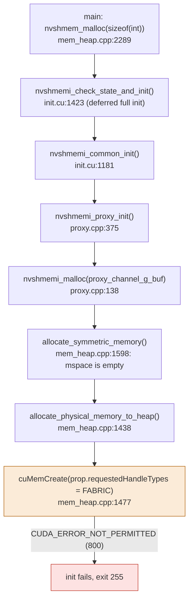
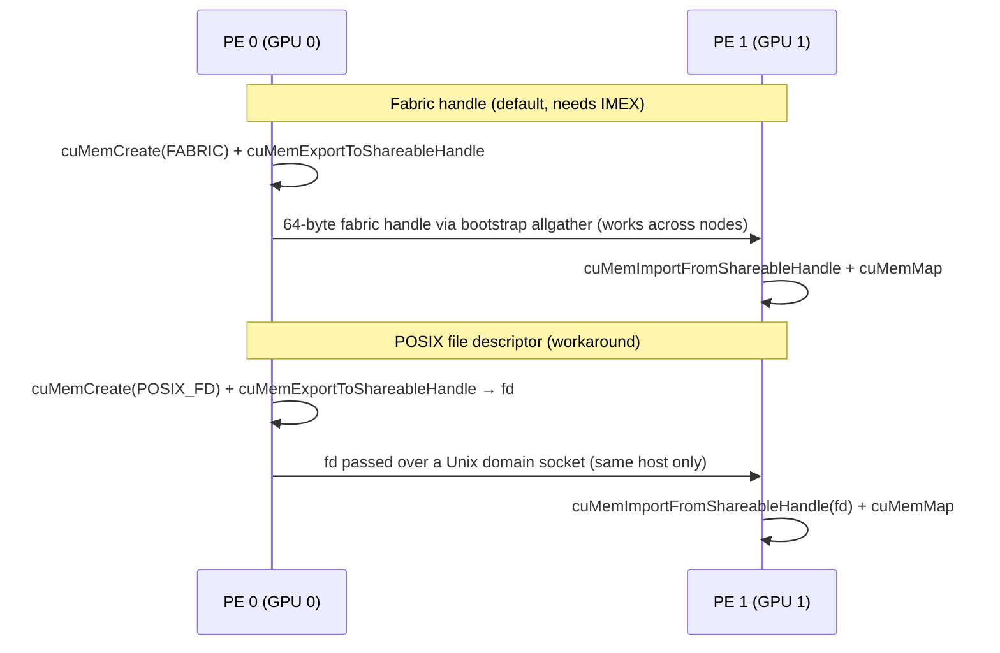

# Why `dev-guide-ring` fails on b4-31-s1-dgx-04-c12

- **Checked:** 2026-09-26, from inside Slurm job 203503 on Beta node `b4-31-s1-dgx-04-c12` (rack B4).
- **Software:** NVSHMEM 3.9.0.dev0 at `~/nvshmem/install`, built in `nvcr.io/nvidia/pytorch:25.06-py3` (CUDA 12.9). Driver 580.126.16.
- **Scope:** no Slurm jobs or steps were launched. Every command below was either a read-only query or a single-process run inside the existing job's allocation.


## Terminologies

### NVL72 Related

#### 'Node'

**A “node” is one independently running server or OS instance.** What differs is how many GPUs that node contains and how far its NVLink fabric reaches.

|                                          | 8×H100 machine, such as DGX H100                  | GB200 NVL72 compute tray                                     |
| ---------------------------------------- | ------------------------------------------------- | ------------------------------------------------------------ |
| Usually counted as                       | **1 compute node**                                | **1 compute node**                                           |
| GPUs visible to its OS                   | 8 H100 GPUs                                       | 4 Blackwell GPUs                                             |
| NVLink domain                            | The 8 GPUs in that machine                        | Part of a **72-GPU domain spanning 18 compute nodes**        |
| Communication with a GPU on another node | Typically through the NIC and InfiniBand/Ethernet | **Through NVLink/NVSwitch** if the other tray is in the same NVL72 domain |

NVIDIA describes the DGX H100 as an eight-GPU system, and e**xplicitly calls an NVL72 compute tray a node that runs its own OS image**. An NVL72 rack contains 18 such compute nodes. [NVIDIA DGX H100/H200 User Guide](https://docs.nvidia.com/dgx/dgxh100-user-guide/introduction-to-dgxh100.html?utm_source=chatgpt.com)

Here is the source of the confusion: **“node” describes a computer boundary; “NVLink domain” describes a GPU interconnect boundary.** 

- On an 8×H100 server, those boundaries roughly coincide: its eight GPUs are connected by the server’s NVSwitches, while another server is reached through the cluster network. 
- On NVL72, they do not coincide: tray A and tray B are separate nodes with separate OS instances, yet their GPUs can communicate through the *same rack-wide* NVLink/NVSwitch fabric.


### IMEX Channels

]NVIDIA IMEX **(Internode Memory Exchange)** channels are logical character device nodes that allow secure GPU memory mapping and isolation across multi-node NVLink networks

Core Purpose

- **Cross-Node Memory Sharing:** Enables CUDA applications to **securely share memory across different compute nodes** using NVLink backplanes and TCP/IP communication. [[1](https://docs.nvidia.com/multi-node-nvlink-systems/mnnvl-user-guide/overview.html)]
- **User-Based Isolation:** Provides memory isolation in multi-user environments by requiring distinct channel nodes per user. [[1](https://github.com/NVIDIA/multi-gpu-programming-models/issues/19), [2](https://docs.nvidia.com/multi-node-nvlink-systems/imex-guide/imexchannels.html)]
- **Permission Management:** Prevents unauthorized cross-node data access; missing or unconfigured channels result in CUDA API permission errors


## Summary

- **The error.** `dev-guide-ring` **dies inside `nvshmem_malloc()`** with `cuMemCreate failed … CUDA_ERROR_NOT_PERMITTED`.
- **What NVSHMEM is doing.** On GB200, NVSHMEM allocates its symmetric heap as ***fabric-shareable* memory (`CU_MEM_HANDLE_TYPE_FABRIC`).** That lets GPUs on other nodes of the same NVL72 rack map the memory directly.
- **Why the driver refuses.** **Fabric memory is only allowed for a process that can open an *IMEX channel*.** 
  - On this node the channel's device file, **`/dev/nvidia-caps-imex-channels/channel0`, was created with the wrong device numbers.** 
  - It points at a different driver device, so the driver finds no IMEX channel and returns `NOT_PERMITTED`.
- **Who can fix it.** This is a node configuration problem, not an NVSHMEM or build bug. Only the admins can repair the device file.
- **Workaround.** Make NVSHMEM use ordinary *file-descriptor* handles instead of fabric handles, with either `NVSHMEM_CUMEM_HANDLE_TYPE=FILE_DESCRIPTOR` or `NVSHMEM_DISABLE_MNNVL=1`. Both made the program run correctly here.
- **Behaviour on one node.** Output, data path and performance are the same as the original.
- **Behaviour across nodes.** The two workarounds differ (section 6). Use `NVSHMEM_DISABLE_MNNVL=1` for multi-node runs until the node is fixed.


| Run (1 PE, on the node)                     | Heap handle type NVSHMEM chose | Result                                                    |
| ------------------------------------------- | ------------------------------ | --------------------------------------------------------- |
| default                                     | Fabric Handle                  | `cuMemCreate failed … CUDA_ERROR_NOT_PERMITTED`, exit 255 |
| `NVSHMEM_CUMEM_HANDLE_TYPE=FILE_DESCRIPTOR` | POSIX File Descriptor          | `0: received message 0`, exit 0                           |
| `NVSHMEM_DISABLE_MNNVL=1`                   | POSIX File Descriptor          | `0: received message 0`, exit 0                           |


## 1. The symptom

Running the example on this node, with default settings:

```sh
./src/host/mem/mem_heap.cpp:1477: cuMemCreate failed
 Status = CUDA_ERROR_NOT_PERMITTED. Description = operation not permitted
./src/host/mem/mem_heap.cpp:1496: error status: 7 (NVSHMEMX_ERROR_INTERNAL) VMM heap allocation failed on at least one PE
./src/host/mem/mem_heap.cpp:1612: error status: 7 (NVSHMEMX_ERROR_INTERNAL) allocate_physical_memory_to_heap failed
./src/host/proxy/proxy.cpp:139: NULL value failed allocating proxy_channel_g_buf
channel creation failed
```

The last two lines are consequences, not causes. The first failing call is `cuMemCreate` at `mem_heap.cpp:1477`. Every line after it is NVSHMEM reporting that failure further up the stack.

## 2. Where in NVSHMEM it fails

Initialization happens in two stages in this example (see `nvshmem-walkthrough.html`, steps 1 and 3):

1. `nvshmem_init()` runs before `cudaSetDevice()`, so it only does the bootstrap.
2. **The rest of the setup runs inside the first `nvshmem_malloc()`.**

During that deferred setup, the proxy (the CPU helper thread) allocates its own buffers from the symmetric heap. 

- That is the first time the heap needs physical GPU memory. 
- The heap starts empty, and with CUDA VMM it grows by calling `cuMemCreate`:



So the failure is not specific to the user's 4-byte buffer. Any NVSHMEM program on this node fails the first time the heap needs memory.

## 3. Why the driver refuses fabric memory

### What an IMEX channel is

On GB200 NVL72, a GPU can map memory that physically lives on a GPU in *another node* of the same rack (multi-node NVLink, MNNVL). The node-to-node sharing is brokered by the **IMEX daemon** (`nvidia-imex`). Access is controlled with **IMEX channels**: character devices under `/dev/nvidia-caps-imex-channels/`. A process may create or import fabric memory only if it can open a channel device. The driver checks this when `cuMemCreate` is called with `CU_MEM_HANDLE_TYPE_FABRIC`.

The driver registers IMEX channels as their own character-device class, with a major number listed in `/proc/devices`.

### What is wrong on this node

```sh
$ grep nvidia /proc/devices
497 nvidia-caps
498 nvidia-caps-imex-channels          <- IMEX channels are major 498

$ ls -l /dev/nvidia-caps-imex-channels/
crw-rw-rw- 1 root root 497, 4323 Aug 20 15:32 channel0   <- but channel0 is major 497

$ grep -r . /proc/driver/nvidia/capabilities/ | grep 4323
/proc/driver/nvidia/capabilities/fabric-imex-mgmt:DeviceFileMinor: 4323
/proc/driver/nvidia/capabilities/fabric-imex-mgmt:DeviceFileMode: 256    <- 0400, root-only

$ grep -i imex /proc/driver/nvidia/params
ImexChannelCount: 2048
CreateImexChannel0: 0                 <- the driver did not create channel0 itself
flowchart LR
    subgraph expected["Expected"]
      E1["/dev/nvidia-caps-imex-channels/channel0<br/>c 498, 0"] --> E2["driver: IMEX channel 0 ✔"]
    end
    subgraph actual["On b4-31-s1-dgx-04-c12"]
      A1["/dev/nvidia-caps-imex-channels/channel0<br/>c 497, 4323"] --> A2["driver: nvidia-caps minor 4323<br/>= fabric-imex-mgmt capability"]
      A2 --> A3["no IMEX channel found<br/>→ cuMemCreate(FABRIC) = NOT_PERMITTED"]
    end
```

The file has the right *name* but the wrong *device numbers*:

- Major 497 is the `nvidia-caps` class, and minor 4323 is the **fabric-imex-mgmt** capability, the management device the IMEX daemon uses.
- `CreateImexChannel0: 0` means the driver did not create `channel0` itself. It was created some other way (by a setup script or by hand) with the wrong major number.
- The rest of the fabric is healthy. `nvidia-smi -q` shows fabric `State: Completed, Status: Success`, and the `nvidia-imex` daemon is running (`systemctl is-active nvidia-imex` → `active`).

### Minimal reproduction without NVSHMEM

Calling the CUDA driver directly from Python gives the same result. The device reports fabric support, and file-descriptor allocations succeed; only fabric allocations are refused:

```text
cuDeviceGetAttribute(FABRIC_SUPPORTED)        -> 0 CUDA_SUCCESS
  fabric handles supported by device          -> 1
cuMemCreate(POSIX_FILE_DESCRIPTOR, 2 MiB)     -> 0 CUDA_SUCCESS
cuMemCreate(FABRIC, 2 MiB)                    -> 800 CUDA_ERROR_NOT_PERMITTED
```

The script is in section 7.


## 4. Why NVSHMEM picks fabric handles

NVSHMEM chooses the heap's handle type once, during setup, in `src/host/mem/mem_transport.cpp:384-437`:

```cpp
nvshmemi_mem_handle_type_ =
    (nvshmemi_has_mnnvl_fabric_ && flag)          // NVML: fabric Completed + non-zero cluster UUID,
        ? CU_MEM_HANDLE_TYPE_FABRIC                // and the device supports fabric handles
        : CU_MEM_HANDLE_TYPE_POSIX_FILE_DESCRIPTOR;
...
if (nvshmemi_options.CUMEM_HANDLE_TYPE_provided) {  // NVSHMEM_CUMEM_HANDLE_TYPE overrides it
    if (strcmp_case_insensitive(nvshmemi_options.CUMEM_HANDLE_TYPE, "FABRIC") == 0) { ...FABRIC... }
    else if (strcmp_case_insensitive(nvshmemi_options.CUMEM_HANDLE_TYPE, "ANY") == 0) { ...FABRIC|FD... }
    else { nvshmemi_mem_handle_type_ = CU_MEM_HANDLE_TYPE_POSIX_FILE_DESCRIPTOR; }
}
```

**NVSHMEM checks whether the *fabric* is healthy (NVML) and whether the *device* supports fabric handles (CUDA)**. 

Both are true on this node. It does not check whether *this process may use* fabric memory, which is exactly what the broken IMEX channel prevents. So NVSHMEM confidently picks fabric handles, and the first `cuMemCreate` fails. With debug logging on, the chosen type is printed:

```text
NVSHMEM INFO Multi-node NVLink is supported and enabled on this platform
NVSHMEM INFO Symmetric Memory Heap Handle Type: Fabric Handle
./src/host/mem/mem_heap.cpp:1477: cuMemCreate failed
```


## 5. The workarounds and why they work

Both workarounds make NVSHMEM allocate its heap with `CU_MEM_HANDLE_TYPE_POSIX_FILE_DESCRIPTOR`. That handle type does not involve IMEX at all, so the broken channel device no longer matters. The reproduction in section 3 shows the driver accepts these allocations.

### Option A: `NVSHMEM_CUMEM_HANDLE_TYPE=FILE_DESCRIPTOR`

This is the override branch shown in section 4. Any value other than `FABRIC` or `ANY` selects POSIX file descriptors.

```text
NVSHMEM INFO Multi-node NVLink is supported and enabled on this platform   <- MNNVL still considered on
NVSHMEM INFO Symmetric Memory Heap Handle Type: POSIX File Descriptor
0: received message 0
```

### Option B: `NVSHMEM_DISABLE_MNNVL=1`

This skips multi-node-NVLink discovery entirely (`mem_transport.cpp:86` and `:309`). With no MNNVL fabric detected, the default rule in section 4 falls through to POSIX file descriptors.

```text
NVSHMEM INFO Symmetric Memory Heap Handle Type: POSIX File Descriptor      <- no MNNVL line at all
0: received message 0
```

### How file-descriptor sharing works

On a single node, GPUs in different processes still share heap memory. The mapping is set up differently, but the result is the same:



The file-descriptor exchange is in `exchange_p2p_memory_handle()` (`src/host/mem/heap_registration.cpp:351-425`), which starts with the comment "POSIX handles are exchanged for intra-node GPU communication". It uses `ipcSendFd`/`ipcRecvFd` over sockets named by process ID, so it can only reach processes on the same host.

## 6. Does the workaround change the program's behaviour?

### On one node: no

- **Output.** With 4 PEs on one node, each PE still writes its rank into the next PE's `destination`, and each prints its left neighbour's rank. The single-PE runs above printed the expected `0: received message 0`.
- **Data path.** Both handle types map *the same physical GPU memory* into each peer's address space at the same place. After setup, `peer_heap_base_p2p[pe]` is non-null either way, so `nvshmem_int_p` compiles to the same plain store over NVLink. The barrier also uses the same stores. Nothing on the GPU side knows which handle type was used.
- **Performance.** Puts, gets and barriers perform the same. The only difference is setup: file descriptors travel over Unix sockets instead of the bootstrap allgather. That is a small, one-time cost, and it also applies when the heap grows.
- **Commonness.** File-descriptor handles are NVSHMEM's normal choice on every system without MNNVL (for example, 8-GPU HGX servers), so this is a well-used code path.

### Across nodes: yes, and the two options differ

Without the IMEX fix, direct NVLink access *between nodes* is impossible, because it needs fabric handles.

|                                            | Same-node peers   | Other-node peers in the same rack                            | Expected result for a multi-node run |
| ------------------------------------------ | ----------------- | ------------------------------------------------------------ | ------------------------------------ |
| Original (fabric)                          | NVLink load/store | NVLink load/store (MNNVL)                                    | fails on this node (`NOT_PERMITTED`) |
| **A:** `CUMEM_HANDLE_TYPE=FILE_DESCRIPTOR` | NVLink load/store | still marked NVLink-reachable, but file descriptors cannot cross hosts | **likely fails during heap setup**   |
| **B:** `DISABLE_MNNVL=1`                   | NVLink load/store | InfiniBand through the CPU proxy (`ibrc`)                    | should run, slower between nodes     |

Option A is unsafe across nodes because of ordering in `mem_transport.cpp`:

1. The list of pointer-reachable PEs, `uc_ptr_connected_pes`, is built from the NVML fabric information (around lines 392-420) *before* the override is applied (line 426).
2. So peers on other nodes of the same rack are still treated as directly mappable.
3. NVSHMEM would then try to pass them file descriptors, which cannot leave the host.

Option B turns MNNVL discovery off. Peers on other nodes then fail the same-host check in the P2P transport (`src/host/transport/p2p/p2p.cpp:73`) and fall back to the network transport. That changes behaviour in two ways:

- Puts to other nodes go through the proxy and InfiniBand instead of single NVLink stores. Latency is much higher and bandwidth lower.
- The job is no longer "load/store only", so every barrier starts with a quiet, and barrier signals become network atomics (walkthrough step 5).

The program still produces the same output.

**A correction to my earlier advice:** in the conversation I said that with the file-descriptor workaround, traffic between nodes would probably fall back to InfiniBand. The code shows that holds for option B, not option A.

**Recommendation:** `NVSHMEM_CUMEM_HANDLE_TYPE=FILE_DESCRIPTOR` is fine for single-node runs. Use `NVSHMEM_DISABLE_MNNVL=1` for anything that might span nodes, until the admins fix `channel0`.

## 7. Commands used

All commands ran on `b4-31-s1-dgx-04-c12`, in an SSH session that the cluster attaches to job 203503. Shell startup output (`Agent pid …`) was filtered out.

### 7.1 Node, job and fabric state (read-only)

```bash
hostname
module load slurm; squeue -j 203503 -o "%i %q %T %M %N"
nvidia-smi --query-gpu=index,name,driver_version --format=csv,noheader
nvidia-smi -q | grep -A6 -E '^\s+Fabric$'          # State Completed, Status Success, ClusterUUID eee6e4cb-...
```

### 7.2 IMEX channel and driver configuration (read-only)

```bash
grep -n nvidia /proc/devices                       # 497 nvidia-caps, 498 nvidia-caps-imex-channels
ls -l /dev/nvidia-caps-imex-channels/              # channel0 is c 497,4323 (wrong major)
ls -l /dev/nvidia-caps/                            # nvidia-cap4323 is c 497,4323, mode 0400
grep -r . /proc/driver/nvidia/capabilities/ | grep -E '4323|imex'   # 4323 = fabric-imex-mgmt
grep -iE imex /proc/driver/nvidia/params           # CreateImexChannel0: 0
pgrep -a nvidia-imex; systemctl is-active nvidia-imex               # daemon running, active
```

### 7.3 Driver-level reproduction (no NVSHMEM)

Saved as `cumem_handle_test.py`. It allocates one granularity-sized chunk (2 MiB) on GPU 0 with each handle type, then frees it. Run with the system Python: `/usr/bin/python3 cumem_handle_test.py`.

```python
import ctypes
cuda = ctypes.CDLL("libcuda.so.1")

class CUmemLocation(ctypes.Structure):
    _fields_ = [("type", ctypes.c_int), ("id", ctypes.c_int)]
class AllocFlags(ctypes.Structure):
    _fields_ = [("compressionType", ctypes.c_ubyte), ("gpuDirectRDMACapable", ctypes.c_ubyte),
                ("usage", ctypes.c_ushort), ("reserved", ctypes.c_ubyte * 4)]
class CUmemAllocationProp(ctypes.Structure):
    _fields_ = [("type", ctypes.c_int), ("requestedHandleTypes", ctypes.c_int),
                ("location", CUmemLocation), ("win32HandleMetaData", ctypes.c_void_p),
                ("allocFlags", AllocFlags)]

def name(rc):
    s = ctypes.c_char_p(); cuda.cuGetErrorName(rc, ctypes.byref(s))
    return s.value.decode() if s.value else str(rc)

cuda.cuInit(0)
dev = ctypes.c_int(); cuda.cuDeviceGet(ctypes.byref(dev), 0)
ctx = ctypes.c_void_p(); cuda.cuDevicePrimaryCtxRetain(ctypes.byref(ctx), dev); cuda.cuCtxSetCurrent(ctx)
fab = ctypes.c_int(); cuda.cuDeviceGetAttribute(ctypes.byref(fab), 128, dev)   # HANDLE_TYPE_FABRIC_SUPPORTED
print("fabric handles supported by device:", fab.value)

for label, htype in {"POSIX_FILE_DESCRIPTOR": 0x1, "FABRIC": 0x8}.items():
    prop = CUmemAllocationProp(); prop.type = 1; prop.requestedHandleTypes = htype   # PINNED
    prop.location.type = 1; prop.location.id = dev.value                             # DEVICE
    gran = ctypes.c_size_t(); cuda.cuMemGetAllocationGranularity(ctypes.byref(gran), ctypes.byref(prop), 0)
    h = ctypes.c_ulonglong()
    rc = cuda.cuMemCreate(ctypes.byref(h), gran, ctypes.byref(prop), ctypes.c_ulonglong(0))
    print(f"cuMemCreate({label}) -> {rc} {name(rc)}")
    if rc == 0: cuda.cuMemRelease(h)
cuda.cuDevicePrimaryCtxRelease(dev)
```

### 7.4 Running the real program as a single PE

Started with no launcher, NVSHMEM's PMI bootstrap falls back to a one-PE job. That is enough to reach `nvshmem_malloc` and the failing `cuMemCreate`. The binary needs `libcudart.so.12`, which exists only inside the container. For these runs on the host, I copied it out of the running `dev` container's filesystem:

```bash
D=<scratch dir>; mkdir -p $D/lib
cp -L /proc/<pid of a process in the dev container>/root/usr/local/cuda-12.9/targets/sbsa-linux/lib/libcudart.so.12 $D/lib/

# default: fails
LD_LIBRARY_PATH=$D/lib ~/nvshmem/install/bin/examples/dev-guide-ring

# same, showing which handle type NVSHMEM picked
LD_LIBRARY_PATH=$D/lib NVSHMEM_DEBUG=INFO NVSHMEM_DEBUG_SUBSYS=ALL ~/nvshmem/install/bin/examples/dev-guide-ring \
  | grep -E 'Multi-node NVLink|Handle Type|received message|cuMemCreate failed'

# workaround A
LD_LIBRARY_PATH=$D/lib NVSHMEM_CUMEM_HANDLE_TYPE=FILE_DESCRIPTOR NVSHMEM_DEBUG=INFO NVSHMEM_DEBUG_SUBSYS=ALL \
  ~/nvshmem/install/bin/examples/dev-guide-ring

# workaround B
LD_LIBRARY_PATH=$D/lib NVSHMEM_DISABLE_MNNVL=1 NVSHMEM_DEBUG=INFO NVSHMEM_DEBUG_SUBSYS=ALL \
  ~/nvshmem/install/bin/examples/dev-guide-ring
```

Inside the container you don't need the copy. Run `~/nvshmem/install/bin/examples/dev-guide-ring` directly, with the same environment variables.

### 7.5 Source locations read

| What                                                        | Where                                                        |
| ----------------------------------------------------------- | ------------------------------------------------------------ |
| Failing `cuMemCreate` and its error handling                | `src/host/mem/mem_heap.cpp:1438-1576` (`allocate_physical_memory_to_heap`) |
| Proxy buffer allocation that triggers the first heap growth | `src/host/proxy/proxy.cpp:138-140`                           |
| Handle-type choice and `NVSHMEM_CUMEM_HANDLE_TYPE` override | `src/host/mem/mem_transport.cpp:384-448`                     |
| `NVSHMEM_DISABLE_MNNVL` gates                               | `src/host/mem/mem_transport.cpp:86`, `:309`; `src/include/host/env/env_defs.h:220` |
| MNNVL pointer-reachable PE list (built before the override) | `src/host/mem/mem_transport.cpp:392-420`                     |
| File-descriptor exchange (same host only)                   | `src/host/mem/heap_registration.cpp:351-425`                 |
| P2P reachability: fabric first, then same-host check        | `src/host/transport/p2p/p2p.cpp:56-76`                       |

## 8. What was not tested

- **4 PEs on one node** (the normal way to run this example). I didn't launch it, because it needs an `srun` step. Section 6 argues that behaviour and output are unchanged, but that is not confirmed by a run. Launch commands are in the conversation; add `NVSHMEM_CUMEM_HANDLE_TYPE=FILE_DESCRIPTOR` or `NVSHMEM_DISABLE_MNNVL=1`.
- **Multi-node runs** with either workaround. The expected results in the section 6 table come from reading the code only.
- **Other Beta nodes.** Update 2026-09-28: `b1-29-s1-dgx-01-c10` (rack B1, job 203744) has the same broken node (`channel0` is `c 497,4323` while `/proc/devices` lists IMEX channels as 498), so the problem is not limited to one node or rack. Other nodes are unchecked. Before assuming a node is affected, compare `grep imex /proc/devices` with `ls -l /dev/nvidia-caps-imex-channels/`.

## 9. Report for the admins

Suggested text for a Freshdesk ticket or an email to sysadmin@empireai.edu:

> On Beta nodes b4-31-s1-dgx-04-c12 and b1-29-s1-dgx-01-c10, `/dev/nvidia-caps-imex-channels/channel0` has device numbers `c 497,4323`. The driver registers `nvidia-caps-imex-channels` as major 498 (`/proc/devices`). Minor 4323 under major 497 is the `fabric-imex-mgmt` capability (`/proc/driver/nvidia/capabilities/fabric-imex-mgmt`, intended mode 0400), and the `channel0` node is mode 0666. Because there is no valid IMEX channel, `cuMemCreate` with `CU_MEM_HANDLE_TYPE_FABRIC` fails with `CUDA_ERROR_NOT_PERMITTED`, which breaks NVSHMEM, NCCL and other multi-node-NVLink users on this node. The driver has `CreateImexChannel0: 0`. Could `channel0` be recreated as `c 498 0` (or the driver loaded with `NVreg_CreateImexChannel0=1`), and could other nodes be checked for the same problem?

The last point also matters for security. A world-writable device node that resolves to the root-only IMEX management capability looks like an unintended permission. That is worth flagging even apart from the NVSHMEM failure.